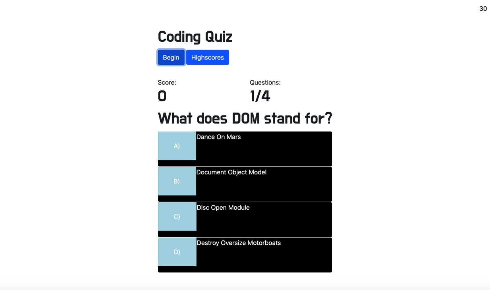

# Coding-Quiz

## Description
This application is a timed quiz that begins when the user clicks "begin".  This event triggers the timer to start as well as displays the questions.  As the user selects answers, if they are correct a score of ten points is incremented to the score.  At the end of the quiz, the user is routed to a page where they can enter their name and save their score in local storage.  
A feature that I was unable to figure out how to implement is when the user clicks the wrong answer, their time left to complete the quiz goes down.  In addition, the console is throwing an error on question 3 and never reaches question 4.  This error completely stumped me because I can't figure out why the first couple of questions worked and then all of a sudden javaScript decided it didn't like my code anymore.  

## Access

This application can be deployed in your web browser via the link below:

https://sleepytomatoes.github.io/Coding-Quiz/

## Resources

I used this tutorial as a guide:

https://www.youtube.com/watch?v=rFWbAj40JrQ&list=PLDlWc9AfQBfZIkdVaOQXi1tizJeNJipEx&index=2